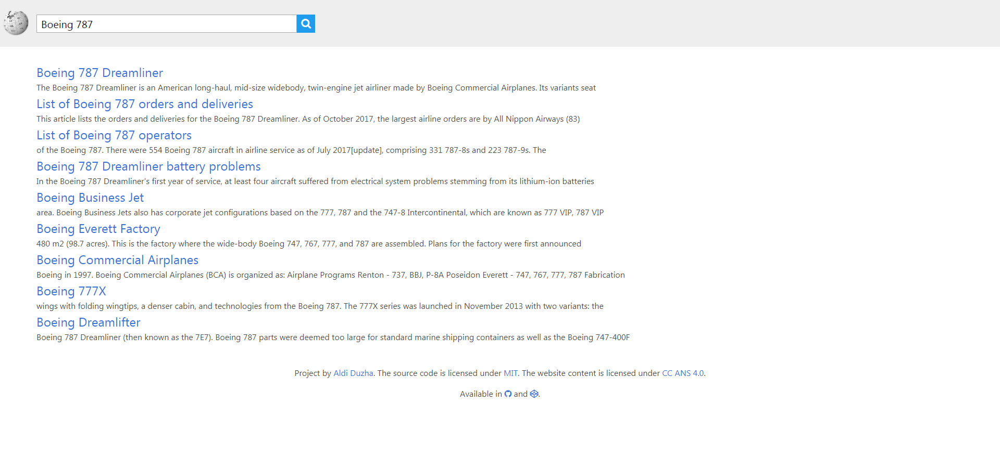

# Wikipedia Search
#### Search engine for Wikipedia articles

  

## Features:

- Awesome Interface thanks to Bulma Framework  
- Google like layout for Search Results  
- Articles open on a new tab when clicking links  
- Random Article Button  

## Main Page

## Results for "Boeing 787".

## License

Licensed under [MIT](LICENSE) by [Aldi](https://aldiduzha.com).
